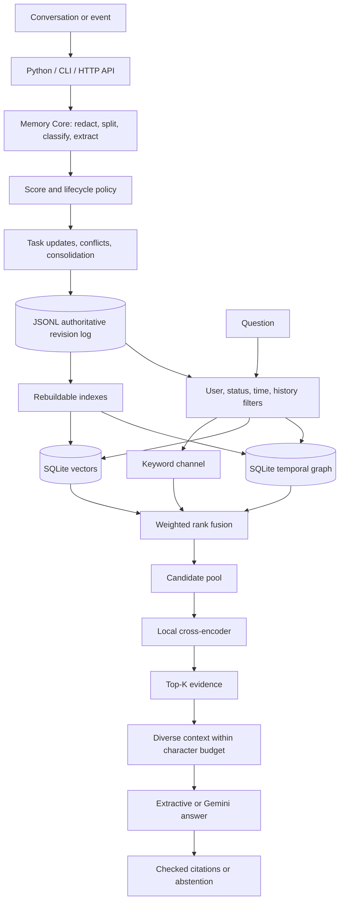

# CogniMem

**A local-first, temporal memory system for personalized AI assistants.** CogniMem turns conversations into inspectable memories, keeps track of changes, and retrieves cited evidence for later answers. It combines rule-based retention, task and conflict management, a temporal knowledge graph, vector search, local reranking, and retrieval-augmented generation (RAG).

> **Research question:** How much does temporal and relational graph retrieval improve vector-based conversational memory retrieval and RAG? The controlled experiment compares vector-only, vector + reranker, vector + graph, and vector + graph + reranker while holding the dataset, prompt, answer policy, context size, and evaluation procedure fixed.

## Why build it?

An ordinary chat model has no reliable, structured account of everything a person said before. Saving every message verbatim is insufficient: greetings and obsolete reminders compete with useful facts; repeated statements waste space; newer facts may contradict older ones; and semantic similarity alone may miss time and relationships. “Where did I live before Bengaluru?” requires history, while “Where is the company I work for based?” may require a two-edge evidence path. A personalized answer should also show which memories support it.

CogniMem separates those responsibilities. It decides what to retain, preserves corrections and provenance, represents relationships with valid and recorded time, searches several evidence channels, and constrains answers to cited context. A personal assistant could remember communication preferences; a project copilot could track decisions, collaborators, and changing facts; a task assistant could retain deadlines and recurring work. The integrating application still owns the chat interface, consent, and any calendar or reminder delivery.

## What works today

| Capability | Implementation |
| --- | --- |
| Intake | Sensitive-pattern redaction, optional statement splitting, six rule-based categories, feature extraction, claims, and typed relation metadata. |
| Retention | Heuristic scorer by default; optional XGBoost and neural retention-proxy scorers; working, short-term, long-term, and archive tiers. |
| Updates | Task completion/cancellation/rescheduling and recurrence; supported fact/preference conflict resolution; evidence-preserving consolidation and history. |
| Storage | Local JSONL revision log with SQLite vector/graph indexes, cross-process locks, cleanup preview, guarded physical deletion, and compaction. |
| Retrieval | Ranked keyword, semantic/vector, graph, recency, and hybrid search; rank fusion and local cross-encoder reranking. |
| Answers | Diverse bounded context, extractive answers, optional LangChain/Gemini 2.5 Flash, citation checks, and abstention. |
| Interfaces | Python API, CLI, and FastAPI with authentication, user isolation, export/deletion, health, logs, and Prometheus metrics. |

The implementation targets local research and small deployments. [Limits and next steps](#limits-and-next-steps) distinguish working features from broader research claims.

## System architecture



JSONL is the source of truth; vector and graph data are rebuildable indexes. Hybrid channels contribute candidates independently before fusion. The reranker runs locally and falls back to fusion order if it fails. Memory text is sent to Gemini only when a hosted answer is requested; intake, embeddings, graph search, and reranking run locally.

The three main flows are:

1. **Save:** accept a user statement → redact and classify it → compute features, score, and tier → reconcile supported claims/tasks → append a revision to JSONL → synchronize rebuildable indexes on search or explicit indexing.
2. **Update:** accept a new statement or task operation → find the relevant user-owned memory → revise task/conflict/consolidation state → append the new state without losing earlier revisions → refresh index views.
3. **Retrieve and answer:** filter visible memories by user and requested time → collect independent keyword/vector/graph candidates → fuse and optionally rerank → select diverse Top-K evidence → assemble bounded context → return cited extractive or Gemini statements.

### Layer 1: Understand and structure incoming information

`MemoryCore` receives `MemoryInput` with text, user/session IDs, a role, timestamp, and optional metadata. It redacts supported sensitive patterns before scoring or storage. It classifies each statement as `semantic` (durable fact), `episodic` (event), `procedural` (workflow), `preference`, `task`, or `temporary` (transient chat). Optional segmentation creates separate records for clearly independent clauses. It extracts numeric cues such as deadlines, preferences, recency, and category. Supported factual statements become claims; callers can also provide explicit typed entities and relations for graph indexing.

The default `ImportanceScorer` combines deterministic features into a 0–1 score. `LifecycleManager` uses that score and category-specific rules to assign `working`, `short_term`, `long_term`, or `archive`. Temporary messages normally remain working memory, one-off tasks remain short-term even when important, and durable facts or preferences can become long-term. Working memory normally expires after one hour, short-term after fourteen days, and dated tasks after their deadline plus 24 hours. Long-term records can appear as archive views after inactivity. These are policy decisions, not human-labeled truths.

| Category | Typical input | Why it matters later |
| --- | --- | --- |
| Semantic | “My supervisor is Priya.” | Stable facts and relationships. |
| Episodic | “I submitted the proposal yesterday.” | Event history and temporal questions. |
| Procedural | “First run tests, then deploy.” | Reusable instructions. |
| Preference | “I prefer brief explanations.” | Personalization and constraints. |
| Task | “Remind me to submit the report Friday.” | Action state, deadlines, recurrence. |
| Temporary | “Thanks!” | Immediate context without durable retention. |

The optional XGBoost and neural scorers estimate `P(long_term) + 0.5 × P(short_term)` from extracted conversational facts. They predict a **retention-policy proxy**, not human-rated importance, and never replace the heuristic automatically. The neural path freezes the local 384-dimensional BGE encoder, combines text embeddings with 13 numeric features in a two-branch head, and serves its trained head through ONNX.

### Layer 2: Manage change, tasks, and retention

When a supported fact conflicts with an older one, CogniMem identifies a current assertion while preserving the older record and its revision history. “I live in Chennai” followed by “I moved to Bengaluru” can therefore support both current and historical questions. Repeated equivalent memories may be consolidated into a canonical summary with supporting memory IDs, sessions, and observation dates. Ambiguous task references are recorded rather than silently changing an unrelated task; callers can provide an exact task ID.

Tasks support due dates, completion, cancellation, rescheduling, and recurring occurrences. Task state and lifecycle tier are separate fields. Normal retrieval hides expired and resolved items; history controls expose them for inspection. Cleanup previews by default. Its balanced policy protects useful expired items, legal holds, referenced evidence, and unresolved tasks. Applied cleanup removes eligible expired data, compacts only exact duplicate revisions, and rebuilds indexes.

### Layer 3: Persist memories and temporal relationships

`LocalMemoryStore` writes serialized `MemoryRecord` revisions to `memory_store/memories.jsonl` by default. A record contains its category, tier, score, timestamps, task state, claim and conflict status, evidence IDs, and source metadata. Local operations use cross-process locks. SQLite holds chunks and embeddings, graph nodes and edges, aliases, and index state. An LSH vector path supports larger local collections; smaller collections use exact scans.

The graph stores typed relations such as `lives_in`, `works_at`, `based_in`, `likes`, and `has_task`, each linked to its source memory. **Valid time** says when an assertion was true; **recorded time** says when the system learned or revised it. `--as-of` and `--known-at` queries distinguish past truth from past knowledge. Multi-hop retrieval carries the evidence path. Mere graph connectivity is not treated as proof of an unstated fact. Natural-language extraction covers supported patterns and explicit metadata, not arbitrary prose.

### Layer 4: Retrieve and rank evidence

The lightweight `LocalMemoryStore.search()` requires lexical overlap. Its default score weights are keyword relevance **0.65**, category **0.10**, tier **0.05**, recency **0.10**, and importance **0.10**. `MemoryRAG.search()` adds independent vector and graph channels after filtering by user, session, history, task state, expiry, and time.

Hybrid search applies weighted reciprocal-rank fusion to memory IDs, then keeps `max(20, 4 × Top-K)` candidates by default (up to 200). Up to three representative chunks per candidate go to the local `Xenova/ms-marco-MiniLM-L-6-v2` cross-encoder. Each memory takes its best chunk score and keeps that chunk for context; fusion score and ID resolve ties. `--no-rerank` exposes the fusion baseline. Model failure returns fused results with fallback metadata instead of failing retrieval.

### Layer 5: Build context and answer

The context selector rewards query coverage, removes near-duplicate snippets, and respects a character budget. Graph paths are included only when all supporting memories fit. `ask --generator extractive` produces local, deterministic evidence text. The default `ask` path uses LangChain/Gemini 2.5 Flash after a key is configured. Hosted output must contain source IDs and exact supporting quotes found in the supplied context; invalid citations are rejected, and insufficient evidence should lead to abstention. Quote checking verifies provenance, but it cannot by itself prove every semantic inference in a generated statement.

### Layer 6: Expose and operate the system

The CLI supports ingestion, inspection, search, graph queries, answers, history, reconciliation, and cleanup. FastAPI adds signup/login, bearer-token authentication, role checks, per-user memory endpoints, search, JSON/CSV export, account deletion, `/health/live`, `/health/ready`, `/metrics`, structured request logs, and `/docs`. The web demo is mounted at `/demo` when static assets are present. The CLI caller supplies a user ID; API calls derive it from the authenticated user.

## Setup

Run commands from the repository root. Python 3.13 and [uv](https://docs.astral.sh/uv/) are the development path used here; a standard virtual environment and `pip install -r requirements.txt` can also be used if the pinned packages support your platform.

```bash
uv venv --python 3.13 .venv
uv pip install --python .venv/bin/python -r requirements.txt
.venv/bin/python -m main --help
```

Local embedding and reranker models download on first use into the ignored cache under `data/rag/models/`. Store and index files are local runtime data. Optional trained retention scorers need their artifacts present or locally trained; see [reproduction](#reproduce-the-experiments).

For a hosted answer, copy the example environment file and set your key locally. The extractive generator needs no key.

```bash
cp .env.example .env
# Edit .env and set GOOGLE_API_KEY; GEMINI_API_KEY is also accepted.
.venv/bin/python -m main ask "What style of answer do I prefer?" \
  --user-id user_001 --generator gemini
```

The CLI `ask` command loads `.env` by default. The API reads its process environment and also requires a JWT secret of at least 32 bytes:

```bash
export COGNIMEM_JWT_SECRET="$(.venv/bin/python -c 'import secrets; print(secrets.token_urlsafe(48))')"
.venv/bin/python -m api
# Visit http://localhost:8000/docs for the endpoint schemas.
```

`COGNIMEM_STORE`, `COGNIMEM_AUTH_DB`, and `COGNIMEM_INDEX` override local paths. `COGNIMEM_ANN_ENABLED` and `COGNIMEM_ANN_EXACT_THRESHOLD` configure vector indexing. Keep `.env`, tokens, and generated runtime data out of version control.

## First local workflow

These commands save a preference and a location change, then retrieve the current evidence for the same user. First semantic use may download and initialize local models.

```bash
.venv/bin/python -m main process "I prefer concise technical explanations." \
  --user-id user_001 --session-id session_001 --pretty
.venv/bin/python -m main process "I live in Chennai." \
  --user-id user_001 --session-id session_001
.venv/bin/python -m main process "I moved to Bengaluru." \
  --user-id user_001 --session-id session_002

.venv/bin/python -m main list --user-id user_001 --pretty
.venv/bin/python -m main search "Where do I live now?" \
  --user-id user_001 --mode hybrid --limit 5 --pretty
.venv/bin/python -m main ask "Where do I live now?" \
  --user-id user_001 --generator extractive --pretty
```

`index --user-id user_001` builds indexes explicitly; `graph --user-id user_001 --query Bengaluru` inspects relations; `history RECORD_ID --user-id user_001` shows revisions. Keyword search avoids model downloads. `ask --preview` shows context and prompt without calling Gemini. `--no-rerank` and `--candidate-limit 20` support retrieval comparisons. `cleanup --user-id user_001` previews cleanup; `--apply` executes it. Use `.venv/bin/python -m main COMMAND --help` for flags.

Python applications use the same core and store:

```python
from main import LocalMemoryStore, MemoryCore, MemoryInput
from main.retrieval.rag import MemoryRAG

store = LocalMemoryStore()
record = MemoryCore().process(MemoryInput(
    content="I prefer concise technical explanations.",
    user_id="user_001",
    session_id="session_001",
))
store.save(record)
hits = MemoryRAG(store).search("How should you answer me?", user_id="user_001")
print([(hit["memory_id"], hit["text"]) for hit in hits])
```

For optional trained retention scoring, select `MemoryCore.with_ml()` (XGBoost) or `MemoryCore.with_neural()`, or pass `--scorer xgboost` / `--scorer neural` to `process`. These options change retention scoring, not the retrieval model.

An HTTP integration can call the running API instead. Signup returns a bearer token; use its `data.access_token` value in subsequent requests. The authenticated identity determines which memories the caller can access.

```bash
curl -sS http://localhost:8000/api/v1/auth/signup \
  -H 'Content-Type: application/json' \
  -d '{"email":"demo@example.com","password":"a-long-demo-password"}'

# Copy data.access_token from the response into this shell variable.
export COGNIMEM_DEMO_TOKEN='paste-token-here'
curl -sS http://localhost:8000/api/v1/memories \
  -H "Authorization: Bearer $COGNIMEM_DEMO_TOKEN" \
  -H 'Content-Type: application/json' \
  -d '{"content":"I prefer concise answers.","session_id":"demo-session"}'
curl -sS http://localhost:8000/api/v1/memories/search \
  -H "Authorization: Bearer $COGNIMEM_DEMO_TOKEN" \
  -H 'Content-Type: application/json' \
  -d '{"query":"How should you answer me?","mode":"keyword","limit":5}'
```

The `/docs` page documents the other endpoints. Token, store, and index files are local runtime state; do not commit them.

## Evaluation and measured results

**The following tables describe different datasets and tasks. Do not compare their percentages as if they were one experiment.** Retrieval metrics concern evidence selection; RAG metrics concern answers; retention-model metrics concern three-class labels. The numbers below come from saved repository reports.

### Controlled graph and reranker ablation

The [240-query development benchmark](evaluation/RESULTS.md) has 20 developer-labeled cases in each of 12 query types. The BGE model, 20-candidate pool, Top-K values, 10,000-character context budget, answer policy, and evaluation procedure are identical in all four arms. Optional importance models are disabled. Retrieval scores cover the **220 answerable queries**; answer scores include all **240**. `Recall@K` measures labeled evidence found in the first K results; `MRR` rewards early first relevant results; `nDCG` rewards graded relevance and ordering.

| Retrieval system | Recall@5 | Recall@10 | Recall@20 | Hit@5 | Hit@10 | MRR | nDCG@5 | nDCG@10 |
| --- | ---: | ---: | ---: | ---: | ---: | ---: | ---: | ---: |
| Vector | 89.55% | 91.14% | 91.36% | 91.36% | 91.36% | 0.842 | 0.824 | 0.830 |
| Vector + reranker | 91.36% | 91.36% | 91.36% | 91.36% | 91.36% | 0.914 | 0.893 | 0.893 |
| Vector + graph | 91.36% | 91.36% | 91.36% | 91.36% | 91.36% | 0.884 | 0.891 | 0.891 |
| Vector + graph + reranker | 91.36% | 91.36% | 91.36% | 91.36% | 91.36% | 0.914 | 0.893 | 0.893 |

Adding the graph raises Recall@5 by **1.82 percentage points** over vector-only (paired-bootstrap 95% interval **0.68–3.18 points**; paired randomization **p = 0.0072**). Multi-hop Recall@5 rises from **80% to 100%**. Reranking raises vector-only MRR from **0.842 to 0.914**. After graph fusion, reranking leaves Recall@5 unchanged and raises MRR from **0.884 to 0.914**. These are controlled *development* results, not independent evidence of general-world performance. Procedural questions score only **5% Recall@5** in every arm.

The same benchmark uses a deterministic **extractive** answer generator, so it does not measure live Gemini quality:

| RAG system | Correctness | Answer relevance | Faithfulness | Context precision | Context recall |
| --- | ---: | ---: | ---: | ---: | ---: |
| Vector | 91.67% | 91.67% | 100% | 21.08% | 82.08% |
| Vector + reranker | 91.67% | 91.67% | 100% | 21.75% | 83.75% |
| Vector + graph | 91.67% | 91.67% | 100% | 21.75% | 83.75% |
| Vector + graph + reranker | 91.67% | 91.67% | 100% | 21.75% | 83.75% |

| RAG system | Citation precision | Citation recall | Citation completeness | Unsupported claims | Abstention accuracy |
| --- | ---: | ---: | ---: | ---: | ---: |
| Vector | 17.75% | 82.08% | 80.42% | 0% | 91.67% |
| Vector + reranker | 18.42% | 83.75% | 83.75% | 0% | 91.67% |
| Vector + graph | 18.42% | 83.75% | 83.75% | 0% | 91.67% |
| Vector + graph + reranker | 18.42% | 83.75% | 83.75% | 0% | 91.67% |

The 100% faithfulness and 0% unsupported-claim values reflect mechanical quote grounding, not human judgment. Overall abstention accuracy hides a specific failure: all four arms fail to abstain on the unanswerable cases when unrelated context is retrieved. Measured end-to-end development-machine latency:

| System | P50 | P95 | P99 |
| --- | ---: | ---: | ---: |
| Vector | 16.78 ms | 21.49 ms | 23.03 ms |
| Vector + reranker | 38.40 ms | 89.45 ms | 94.04 ms |
| Vector + graph | 25.29 ms | 31.45 ms | 34.13 ms |
| Vector + graph + reranker | 47.04 ms | 98.39 ms | 102.23 ms |

See the [full ablation report](docs/reports/ablation/results.md) and [machine-readable results](docs/reports/ablation/results.json) for query-type metrics, stage timings, and failure cases. The [blind human-review packet](docs/reports/ablation/human_review_blind.jsonl) contains **blank** ratings; independent reviews remain pending.

### External LoCoMo retrieval

The saved [LoCoMo report](docs/reports/locomo_retrieval.json) scores **1,973** questions over externally supplied conversations. It indexes text turns, speakers, and dates without indexing QA labels or summaries. These are evidence-retrieval metrics at K = 5, not generated-answer scores:

| Retriever | Recall@5 | Hit@5 | MRR@5 | nDCG@5 | Mean latency/query |
| --- | ---: | ---: | ---: | ---: | ---: |
| Recency | 0.89% | 1.06% | 0.004 | 0.005 | 0.93 ms |
| Keyword | 37.65% | 41.31% | 0.302 | 0.310 | 6.59 ms |
| Semantic/vector | 43.26% | 47.85% | 0.328 | 0.341 | 13.96 ms |
| Graph-only | 0.00% | 0.00% | 0.000 | 0.000 | 7.60 ms |
| Hybrid fusion | 48.15% | 53.07% | 0.373 | 0.385 | 25.01 ms |
| Hybrid + local reranker | 55.83% | 61.07% | 0.505 | 0.498 | 122.92 ms |

Graph-only retrieves no LoCoMo evidence in this run: raw-turn graph extraction did not cover those questions. This is a counterexample to the controlled graph gain. The more expensive reranker helps hybrid retrieval here. LoCoMo is a generated-dialogue benchmark, not a collection of real user chats. The [evaluation guide](evaluation/README.md) explains exclusions and the broader retention and cleanup studies.

### Optional retention models

XGBoost, an original shallow neural head, and a deeper neural head were evaluated on the same **556-fact** published test split from [Personal Facts (MSC)](https://huggingface.co/datasets/adugeen/personal-facts-msc): 85 invalid, 92 short-term, and 379 long-term. The always-long-term baseline exposes class imbalance. Proxy MAE compares a constructed target (`invalid=0`, `short_term=0.5`, `long_term=1`), not human importance ratings.

| Test metric | Deeper neural | Original neural | XGBoost | Always long-term |
| --- | ---: | ---: | ---: | ---: |
| Accuracy | 78.06% | 78.06% | 69.24% | 68.17% |
| Balanced accuracy | 67.78% | 65.86% | 65.60% | 33.33% |
| Macro F1 | **0.6732** | 0.6504 | 0.6114 | 0.2702 |
| Weighted F1 | 0.7768 | 0.7703 | 0.7071 | 0.5526 |
| Constructed proxy MAE | 0.2160 | **0.1957** | 0.2768 | — |
| Negative log-likelihood | 0.5547 | **0.5345** | — | — |
| Expected calibration error, 10 bins | **0.0163** | 0.0428 | — | — |
| Warm inference P50 | **4.17 ms** | 5.01 ms | — | — |
| Warm inference P95 | **5.79 ms** | 6.74 ms | — | — |

Per-class F1 (invalid / short-term / long-term) is **0.4932 / 0.6570 / 0.8696** for the deeper head, **0.4286 / 0.6455 / 0.8773** for the original, and **0.4574 / 0.5837 / 0.7931** for XGBoost. Invalid-fact recall is **42.35%** for the deeper head, **31.76%** for the original, and **50.59%** for XGBoost; the deeper model does not win every safety-relevant measure. `—` means unrecorded. Neural latency includes local BGE encoding and ONNX inference after warm-up; XGBoost latency was not measured.

Class-level test metrics (support is the number of gold examples):

| Model | Gold class | Support | Precision | Recall | F1 |
| --- | --- | ---: | ---: | ---: | ---: |
| Deeper neural | Invalid | 85 | 0.5902 | 0.4235 | 0.4932 |
| Deeper neural | Short-term | 92 | 0.5913 | 0.7391 | 0.6570 |
| Deeper neural | Long-term | 379 | 0.8684 | 0.8707 | 0.8696 |
| Original neural | Invalid | 85 | 0.6585 | 0.3176 | 0.4286 |
| Original neural | Short-term | 92 | 0.5547 | 0.7717 | 0.6455 |
| Original neural | Long-term | 379 | 0.8682 | 0.8865 | 0.8773 |
| XGBoost | Invalid | 85 | 0.4175 | 0.5059 | 0.4574 |
| XGBoost | Short-term | 92 | 0.4823 | 0.7391 | 0.5837 |
| XGBoost | Long-term | 379 | 0.8782 | 0.7230 | 0.7931 |
| Always long-term | Invalid | 85 | 0 | 0 | 0 |
| Always long-term | Short-term | 92 | 0 | 0 | 0 |
| Always long-term | Long-term | 379 | 0.6817 | 1.0000 | 0.8107 |

Confusion matrices below have gold classes as rows and predicted classes as columns:

| Model | Gold class | Predicted invalid | Predicted short-term | Predicted long-term |
| --- | --- | ---: | ---: | ---: |
| Deeper neural | Invalid | 36 | 18 | 31 |
| Deeper neural | Short-term | 5 | 68 | 19 |
| Deeper neural | Long-term | 20 | 29 | 330 |
| Original neural | Invalid | 27 | 26 | 32 |
| Original neural | Short-term | 2 | 71 | 19 |
| Original neural | Long-term | 12 | 31 | 336 |
| XGBoost | Invalid | 43 | 17 | 25 |
| XGBoost | Short-term | 11 | 68 | 13 |
| XGBoost | Long-term | 49 | 56 | 274 |
| Always long-term | Invalid | 0 | 0 | 85 |
| Always long-term | Short-term | 0 | 0 | 92 |
| Always long-term | Long-term | 0 | 0 | 379 |

The deeper head's mean validation macro F1 over three seeds was **0.7194**, versus **0.7134** for the original; its selected seed reached **0.7291**. The dataset has one annotator, consists of extracted facts, and is not conversation-disjoint. The published test split had already been inspected during XGBoost development. These comparisons are exploratory and do not justify changing the default heuristic or lifecycle thresholds. Detailed class precision/recall, confusion matrices, calibration, and training methods are in the [XGBoost](evaluation/reports/conversational_retention.md), [original neural](evaluation/reports/neural_retention_shallow.md), [deeper neural](evaluation/reports/neural_retention.md), and [depth comparison](evaluation/reports/neural_depth_validation.json) reports.

Model selection used a stratified training/validation split rather than choosing on the test set. XGBoost's four validation trials had macro F1 **0.5934, 0.6022, 0.6002, and 0.6211**; the last configuration (max depth 5, min child weight 8, 396 trees on refit) was selected. The original neural head's three best-checkpoint validation macro F1 values were **0.7175, 0.7057, and 0.7169** for seeds 42–44; the deeper head's were **0.7208, 0.7083, and 0.7291**. The selected original checkpoint used seed 42, epoch 4; the deeper checkpoint used seed 44, epoch 8. Temperature calibration reduced validation negative log-likelihood from **0.5644 to 0.5332** for the original (temperature 1.3946) and from **0.7913 to 0.5385** for the deeper head (temperature 2.4057).

### Rule and lifecycle checks

The saved [48-case conversational report](docs/reports/conversational_evaluation.json) has **48/48** category and tier matches against developer-authored labels, category macro F1 **1.0**, and **48/48** importance-range matches. These cases helped develop the rules, so this is regression coverage rather than an independent accuracy estimate. The controlled lifecycle audit passes **14/14** checks for tiers, expiry, task changes, recurrence, archive views, and history preservation. Independent human labels and reviews remain outstanding.

## Reproduce the experiments

After installation, run from the repository root:

```bash
.venv/bin/python -m evaluation.run                  # Four-arm graph/reranker ablation
.venv/bin/python -m evaluation.evaluate             # 48 conversational cases
.venv/bin/python -m evaluation.lifecycle            # Lifecycle audit
.venv/bin/python -m evaluation.benchmark            # LoCoMo; see evaluation/README.md for data setup
.venv/bin/python -m training.train_conversational_retention
.venv/bin/python -m training.train_neural_retention
.venv/bin/python -m training.compare_neural_depth
```

Training and external benchmarks can require dataset/model downloads and substantial CPU time. Check each command's `--help` and the [evaluation guide](evaluation/README.md) before rerunning saved reports. The ablation defaults to extractive answers; optional `--generator gemini` makes hosted calls only after a key is configured and uses the same generator across all four arms.

To run automated tests, install a test runner with `uv pip install --python .venv/bin/python pytest`, then run `.venv/bin/python -m pytest -q`. The repository's `requirements.txt` contains runtime dependencies, not pytest.

## Repository map

| Path | Responsibility |
| --- | --- |
| [`main/domain/`](main/domain/) | Models, text rules, classification, scoring, lifecycle, tasks, privacy, claims, reconciliation. |
| [`main/application/`](main/application/) | Memory Core orchestration and maintenance. |
| [`main/storage/`](main/storage/) | JSONL revisions, locks, SQLite index structures, cleanup. |
| [`main/graph/`](main/graph/) | Temporal entities/relations, provenance, historical and multi-hop queries. |
| [`main/retrieval/`](main/retrieval/) | Keyword ranking, BGE embeddings, hybrid search, reranking, context, answers. |
| [`main/ml.py`](main/ml.py), [`main/neural.py`](main/neural.py), [`training/`](training/) | Optional retention scorers and training. |
| [`api/`](api/), [`static/`](static/) | Authenticated HTTP API, monitoring, privacy operations, demo. |
| [`evaluation/`](evaluation/), [`docs/reports/`](docs/reports/) | Datasets, runners, saved metrics, failure cases, review forms. |
| [`tests/`](tests/) | Automated behavior and integration tests. |

## Limits and next steps

- **Generalization:** controlled query labels are developer-authored; external LoCoMo exposes weak graph coverage. Fresh conversation-disjoint data and independent human ratings are needed for a broader claim.
- **Answer quality:** saved RAG scores use extractive answers. Live Gemini correctness, personalization, citation usefulness, and conflict decisions still need independent review. Exact-quote citation validation alone cannot prove semantic truth.
- **Extraction and retention:** graph extraction and indirect contradiction handling cover supported language patterns. Optional retention models learn fact validity/duration rather than human importance; the heuristic remains the default.
- **Operations:** local JSONL and SQLite are not a production database architecture. Deployment needs backups, retention-policy review, stronger authorization/abuse controls, and workload-specific scale and latency measurements.

For more implementation detail and day-to-day workflows, see [DOCUMENTATION.md](DOCUMENTATION.md). For evaluation protocols, see [evaluation/README.md](evaluation/README.md) and the saved reports linked above.
