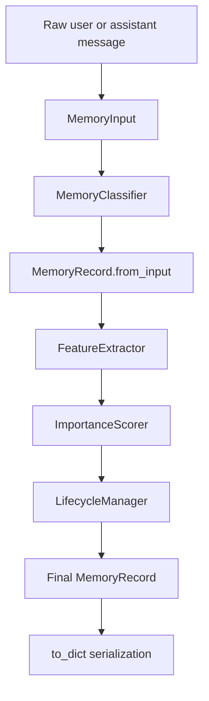
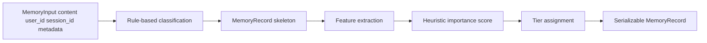
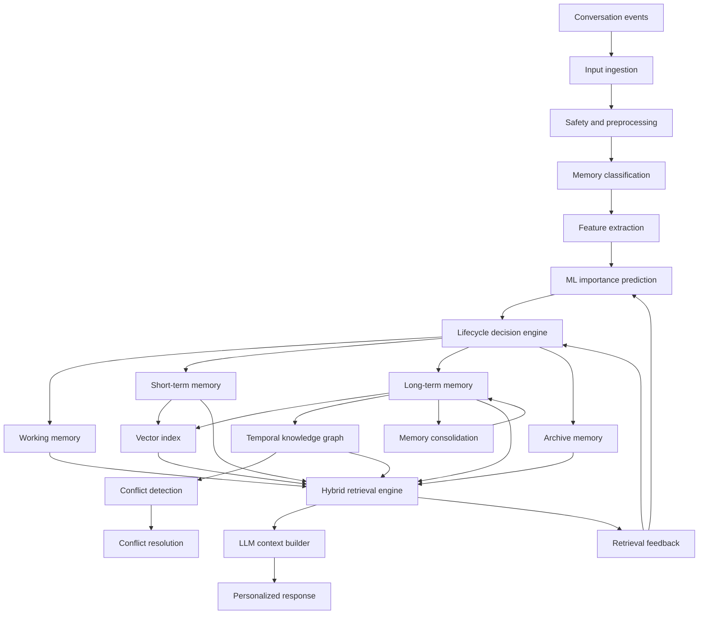
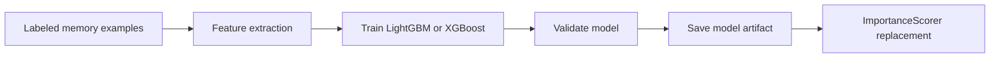
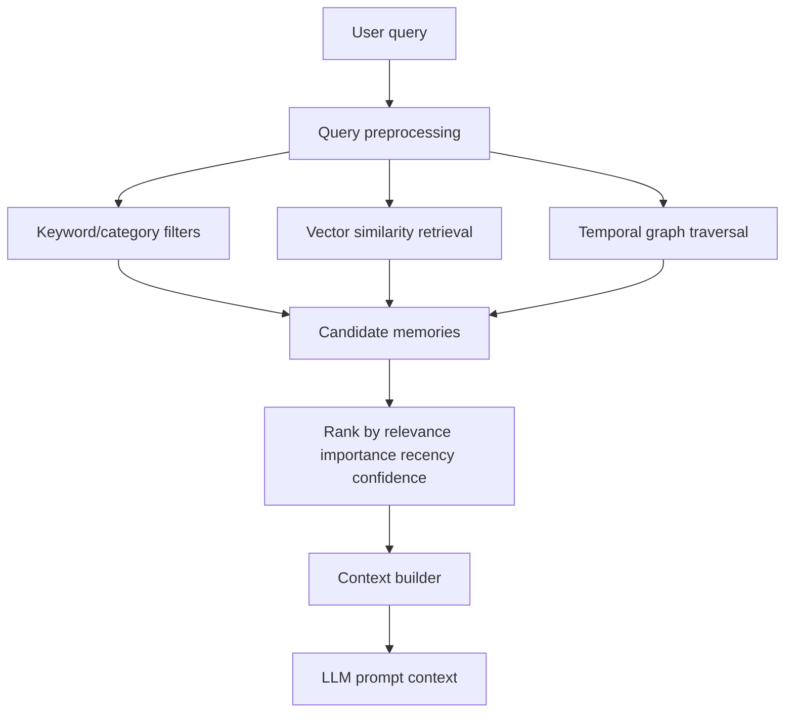

# CogniMem System Design Document

Status: Draft

Owner: Joseph Remingston L

Last updated: September 1, 2026

Related docs:

- `README.md`
- `data/Capstone Project Proposal.pdf`
- `data/Capstone_Base_Paper_Analysis.docx`
- `data/RAG-Driven_Memory_Architectures_in_Conversational_LLMsA_Literature_Review_With_Insights_Into_Emerging_Agriculture_Data_Sharing.pdf`

Scope: This document describes the current implemented Memory Core and the planned complete CogniMem capstone architecture. It clearly separates implemented functionality from planned future components.

## 1. Abstract

CogniMem is a Cognitive Hybrid Memory Architecture for long-term personalized LLM agents. The project is based on the observation that standard vector-only RAG memory systems struggle with long-term personalization, temporal reasoning, contradictory information, lifecycle management, and structured memory types.

The repository currently implements the first foundation layer: a non-database Memory Core. This layer accepts raw interaction content, classifies the content into a memory category, extracts scoring features, calculates a heuristic importance score, assigns a lifecycle tier, and returns a serializable memory record.

The complete capstone system is planned to extend this core with persistent storage, retrieval, ML-based importance prediction, vector search, temporal knowledge graph support, conflict resolution, consolidation, controlled forgetting, evaluation, and API/demo surfaces. These future capabilities are documented here only as planned architecture, not as current implementation.

## 2. Repository Analysis

The current repository contains:

| Area | Status | Notes |
| --- | --- | --- |
| `main/` | Implemented | Python package containing the Memory Core modules. |
| `tests/` | Implemented | Unit tests for classification, scoring, lifecycle assignment, serialization, and graph isolation. |
| `README.md` | Implemented | Current implementation explanation and next-step roadmap. |
| `data/` | Source documentation | Capstone proposal, base paper analysis, and base literature review paper. |
| Database layer | Not implemented | No persistent memory database exists yet. |
| RAG/vector layer | Not implemented | No embeddings, vector store, retriever, or LLM generation pipeline exists yet. |
| Graph layer | Not implemented | Only a placeholder graph adapter protocol exists. |
| ML training | Not implemented | No LightGBM/XGBoost training pipeline or labeled dataset exists yet. |
| CLI/API | Not implemented | No command-line interface or REST API exists yet. |

## 3. Implemented, Partial, Planned, and Out of Scope

Implemented:

- `MemoryInput` model for raw incoming interactions.
- `MemoryRecord` model for normalized memory objects.
- `MemoryCategory` values: `semantic`, `episodic`, `procedural`, `preference`, `task`, and `temporary`.
- `MemoryTier` values: `working`, `short_term`, `long_term`, and `archive`.
- Rule-based memory classification.
- Feature extraction for scoring.
- Heuristic importance scoring.
- Lifecycle tier assignment.
- Serialization and deserialization.
- Tests for core behavior and graph isolation.

Partially implemented:

- Graph integration contract: `GraphMemoryAdapter` exists only as a protocol/interface. There is no graph database implementation.
- Memory lifecycle: tier assignment and expiry/archive hints exist, but no scheduled cleanup, archive migration, or persistence exists.
- Importance modeling: heuristic scoring exists, but no trained ML model exists.

Planned:

- Local persistent storage.
- CLI wrapper.
- REST API using FastAPI or similar.
- LightGBM/XGBoost importance prediction.
- Training dataset generation.
- Vector database and RAG retrieval.
- Temporal knowledge graph.
- Conflict detection and resolution.
- Memory consolidation.
- Controlled forgetting.
- Continuous learning from feedback/retrieval success.
- Evaluation against vector-only RAG, Mem0, MemGPT, LangMem, or similar baselines.

Out of scope for the current phase:

- Neo4j setup.
- Graph schema design.
- Graph traversal.
- Embedding generation.
- LLM response generation.
- Cloud deployment.
- Authentication and authorization.

## 4. Current System Overview

The current implementation solves one narrow but important problem: converting raw conversational content into a structured memory object.

It does not store memories permanently and does not retrieve memories. It only defines the core representation and decision pipeline that future storage and retrieval layers will use.

Current objective:

- Accept a raw interaction.
- Classify the memory type.
- Extract useful memory features.
- Score memory importance.
- Assign a lifecycle tier.
- Return a normalized record.

Current research-methodology alignment:

- The base paper discusses semantic, episodic, procedural, and emotional memory, plus hybrid memory systems.
- The capstone adapts that direction into implementable categories: semantic, episodic, procedural, preference, task, and temporary.
- The current repository implements classification and lifecycle foundations, but not the full hybrid memory architecture yet.

## 5. Current Architecture



Current architecture properties:

- Runs in-process as Python code.
- Uses no external services.
- Uses no database.
- Uses no graph database.
- Uses no vector database.
- Uses no ML training pipeline.
- Produces serializable Python objects.

## 6. Current Component Design

| Component | File | Responsibility | Input | Output |
| --- | --- | --- | --- | --- |
| Public API | `main/__init__.py` | Exposes the Memory Core classes and enums. | Imports from caller code. | Importable package API. |
| Memory models | `main/models.py` | Defines memory input, memory record, categories, tiers, timestamps, and serialization. | Raw field values or dict payload. | `MemoryInput` and `MemoryRecord`. |
| Classifier | `main/classification.py` | Categorizes content using deterministic keyword/pattern rules. | `MemoryInput`. | `MemoryCategory`. |
| Feature extractor | `main/features.py` | Converts content and metadata into numeric scoring features. | `MemoryInput`, `MemoryRecord`. | `dict[str, float]`. |
| Importance scorer | `main/scoring.py` | Applies heuristic weights to features. | Feature dictionary. | Float score from `0.0` to `1.0`. |
| Lifecycle manager | `main/lifecycle.py` | Assigns memory tier and expiry/archive hints. | `MemoryRecord`, score. | `MemoryTier`, timestamp hints. |
| Memory orchestrator | `main/core.py` | Runs the full processing pipeline. | `MemoryInput`. | Final `MemoryRecord`. |
| Graph contract | `main/interfaces.py` | Defines a future adapter protocol only. | `MemoryRecord`. | No implementation. |
| Tests | `tests/test_memory_core.py` | Verifies current behavior. | Unit test examples. | Passing tests. |

## 7. Current Data Contracts

### MemoryInput

| Field | Type | Required | Description |
| --- | --- | --- | --- |
| `content` | `str` | Yes | Raw message text. Must not be empty. |
| `user_id` | `str` | Yes | User identifier. Must not be empty. |
| `session_id` | `str` | Yes | Session/conversation identifier. Must not be empty. |
| `role` | `str` | No | Source role. Defaults to `user`. |
| `timestamp` | `datetime` | No | Message timestamp. Defaults to current UTC time. |
| `metadata` | `dict[str, Any]` | No | Optional caller-provided metadata such as `interaction_score`. |

### MemoryRecord

| Field | Type | Description |
| --- | --- | --- |
| `id` | `str` | Generated UUID for the memory record. |
| `content` | `str` | Cleaned memory content. |
| `user_id` | `str` | User identifier. |
| `session_id` | `str` | Session identifier. |
| `category` | `MemoryCategory` | Classified memory category. |
| `tier` | `MemoryTier` | Assigned lifecycle tier. |
| `created_at` | `datetime` | Creation timestamp. |
| `updated_at` | `datetime` | Last update/access timestamp. |
| `confidence` | `float` | Current default is `1.0`. |
| `importance_score` | `float` | Heuristic importance score. |
| `access_count` | `int` | Access counter, incremented by `touch()`. |
| `source_metadata` | `dict` | Metadata copied from `MemoryInput`. |
| `features` | `dict[str, float]` | Extracted scoring features. |
| `expires_at` | `datetime | None` | Expiry hint for working/short-term memory. |
| `archive_after` | `datetime | None` | Archive hint for long-term memory. |

## 8. Current Data Flow

Input format:

```python
MemoryInput(
    content="I prefer concise technical summaries.",
    user_id="user_001",
    session_id="session_001",
    metadata={"interaction_score": 0.5},
)
```

Intermediate transformations:

- The classifier maps content to one category.
- A `MemoryRecord` is created from the input.
- Feature extraction calculates category flags, recency, entity density, task/preference indicators, sentiment strength, access frequency, and word-count normalization.
- Importance scoring applies heuristic weights.
- Lifecycle assignment chooses the memory tier and timestamp hints.

Output format:

```python
{
    "id": "generated-uuid",
    "content": "I prefer concise technical summaries.",
    "user_id": "user_001",
    "session_id": "session_001",
    "category": "preference",
    "tier": "long_term",
    "importance_score": 0.6337,
    "features": {"category_preference": 1.0, "...": "..."},
    "expires_at": None,
    "archive_after": "future UTC timestamp"
}
```

## 9. Current Model Design

There is no trained ML model in the current system.

Current classifier:

- Type: deterministic rule-based classifier.
- Inputs: raw content from `MemoryInput`.
- Output: one `MemoryCategory`.
- Method: keyword and regular-expression matching.

Current importance model:

- Type: heuristic scoring model.
- Inputs: extracted feature dictionary.
- Output: float score from `0.0` to `1.0`.
- Method: weighted sum with a penalty for temporary memories.

Current lifecycle model:

- Type: deterministic rule-based tier assignment.
- Inputs: `MemoryRecord` and importance score.
- Output: one `MemoryTier`.
- Method: threshold and category checks.

There is no training workflow, no hyperparameter search, no model registry, and no model artifact storage yet.

## 10. Current Storage Design

Current storage is in-memory only.

| Data type | Current storage |
| --- | --- |
| Raw datasets | `data/` contains proposal and research documents only. |
| Processed datasets | Not implemented. |
| Features | Stored only inside returned `MemoryRecord.features`. |
| Trained models | Not implemented. |
| Experiment results | Not implemented. |
| Logs | Not implemented. |
| Configuration files | Not implemented. |
| Memory records | In-memory object only; serializable via `to_dict()`. |

## 11. Current Evaluation

Current evaluation consists of unit tests.

The tests verify:

- Classification for semantic, episodic, procedural, preference, task, and temporary memory.
- Durable memories score higher than greetings.
- Lifecycle tier assignment.
- Serialization/deserialization stability.
- Absence of Neo4j/graph database dependency in the Memory Core.

Run tests:

```bash
python3 -m unittest -v
```

## 12. Current Data Flow Diagram



## 13. Complete Capstone System Overview

The complete CogniMem system will implement a production-oriented hybrid memory engine for personalized LLM agents. It will combine rule-based and ML-based memory decisions, persistent stores, vector retrieval, graph-based temporal reasoning, consolidation, conflict resolution, and evaluation.

The planned system is supported by the capstone proposal and base-paper analysis. The proposal lists working memory, short-term memory, long-term memory, archive memory, RAG, knowledge graphs, and machine learning as core architecture elements.

## 14. Complete Capstone Architecture



Planned complete architecture responsibilities:

- Ingest conversation events with metadata.
- Preprocess and validate input.
- Classify memories into supported memory categories.
- Extract features for ML scoring.
- Predict importance using LightGBM/XGBoost.
- Store memories in appropriate lifecycle tiers.
- Build vector indexes for semantic retrieval.
- Build a temporal knowledge graph for relationships and chronology.
- Detect and resolve contradictory memories.
- Consolidate repeated observations into stronger memories.
- Forget or archive low-value/stale memories.
- Retrieve memory using vector similarity, graph traversal, timestamps, importance score, and user context.
- Evaluate against traditional RAG and existing memory-system baselines.

## 15. Complete System Components

| Component | Planned responsibility | Current status |
| --- | --- | --- |
| Ingestion layer | Accept user/assistant messages and metadata. | Partially implemented through `MemoryInput`. |
| Preprocessing layer | Clean, normalize, validate, and optionally redact input. | Basic validation only. |
| Memory classifier | Classify memory type. | Rule-based version implemented. |
| Feature extractor | Generate scoring features. | Baseline implemented. |
| Importance predictor | Decide storage value using ML. | Heuristic implemented; ML planned. |
| Lifecycle manager | Assign tier, expiry, archive behavior. | Basic tiering implemented. |
| Memory store | Persist memory records. | Planned. |
| Vector store | Store embeddings for retrieval. | Planned. |
| Temporal knowledge graph | Store entities, relationships, and timestamps. | Planned; not current phase. |
| Conflict resolver | Detect contradictory memories and pick retained fact. | Planned. |
| Consolidation engine | Merge repeated observations into higher-level knowledge. | Planned. |
| Forgetting engine | Expire/archive memories based on value and age. | Planned. |
| Hybrid retriever | Combine vector, graph, temporal, importance, and context signals. | Planned. |
| API/CLI | User/developer access surfaces. | Planned. |
| Evaluation pipeline | Compare retrieval accuracy, personalization, efficiency, coherence. | Planned. |

## 16. Complete Training Pipeline

The planned training pipeline will use labeled examples of memory content, category, importance, and lifecycle tier.



Planned training data fields:

- `content`
- `category`
- `importance_score` or `importance_label`
- `tier`
- `recency`
- `access_frequency`
- `sentiment_strength`
- `entity_density`
- `interaction_signal`
- `retrieval_success`

No such training dataset exists yet.

## 17. Complete Retrieval Pipeline



The final retrieval strategy should combine:

- vector similarity
- graph traversal
- timestamp/recency
- importance score
- confidence
- user/session context
- memory tier

This retrieval pipeline is planned but not implemented.

## 18. APIs and Interfaces

Current public Python interface:

```python
from main import MemoryCore, MemoryInput

record = MemoryCore().process(
    MemoryInput(
        content="I prefer concise technical summaries.",
        user_id="user_001",
        session_id="session_001",
    )
)
```

Planned CLI interface:

```bash
python3 -m main process --user-id user_001 --session-id session_001 "I prefer concise summaries"
python3 -m main list --user-id user_001
python3 -m main search --user-id user_001 --query "technical summaries"
```

Planned REST API examples:

```text
POST /memories/process
GET /memories?user_id=...
GET /memories/search?user_id=...&query=...
POST /memories/feedback
```

REST API endpoints are not implemented yet.

## 19. Security and Privacy Considerations

Current state:

- No persistent sensitive-data storage exists yet.
- No authentication exists yet.
- No logging exists yet.
- No API surface exists yet.

Future requirements:

- User memory must be isolated by `user_id`.
- Sensitive content should be minimized and redacted where possible.
- Logs should not leak raw private memory content.
- Deletion/export workflows should be added before production use.
- Any graph/vector/database layer must enforce user-level data boundaries.
- Retrieval must avoid mixing memories between users or sessions.

## 20. Operational Readiness

Current operational readiness is limited to local unit tests.

Future operational signals:

| Signal | Purpose |
| --- | --- |
| Processing success rate | Confirm memory events are processed reliably. |
| Classification distribution | Detect classifier drift or rule mistakes. |
| Importance score distribution | Detect scoring bias or threshold problems. |
| Retrieval precision/recall | Evaluate memory usefulness. |
| Storage growth | Monitor memory bloat. |
| Conflict rate | Track contradictory memories. |
| Consolidation rate | Measure reduction in repeated memories. |
| Forgetting/archive rate | Confirm lifecycle cleanup works. |

## 21. Alternatives Considered

| Alternative | Why considered | Why not selected as the current architecture |
| --- | --- | --- |
| Vector-only RAG memory | Simple and common for conversational memory. | The proposal identifies limitations in chronology, personalization, lifecycle management, and conflict handling. |
| Graph-only memory | Strong for relationships and temporal reasoning. | Does not solve semantic similarity retrieval alone and is intentionally deferred for this phase. |
| LLM-only memory extraction | Flexible and semantically rich. | Adds cost, latency, nondeterminism, and external dependencies before the core is stable. |
| ML-first classifier/scorer | Better long-term adaptability. | Requires labeled data that does not exist yet. |
| Full-stack implementation first | Would show an end-to-end demo earlier. | Higher risk because core contracts, memory schema, and lifecycle behavior need to stabilize first. |

## 22. Open Questions

- What storage backend should be used first: JSONL, SQLite, or a document database?
- What labeled dataset will be used to train the LightGBM/XGBoost importance model?
- Which embedding model and vector database should be used for RAG retrieval?
- What exact graph schema should represent users, memories, entities, relationships, and timestamps?
- What evaluation dataset and metrics will compare CogniMem against baseline memory systems?
- How should privacy, deletion, and export be handled for user memories?

## 23. Recommended Next Steps

1. Add a CLI wrapper around `MemoryCore.process()`.
2. Add local JSONL or SQLite persistence.
3. Add list/search commands for stored memories.
4. Create a labeled training dataset format.
5. Train and evaluate an ML importance scorer.
6. Add conflict detection and consolidation.
7. Add vector retrieval.
8. Add graph database layer after the non-graph pipeline is stable.

## 24. Current Milestone

The current milestone is:

```text
Structured Memory Core implemented.
```

The project has implemented memory structure and processing decisions. It has not yet implemented storage, RAG, graph database, ML training, APIs, CLI, or deployment.
