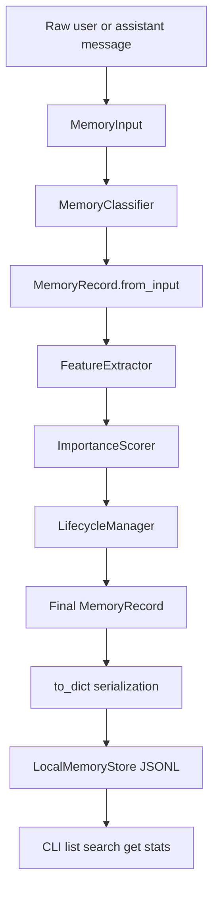
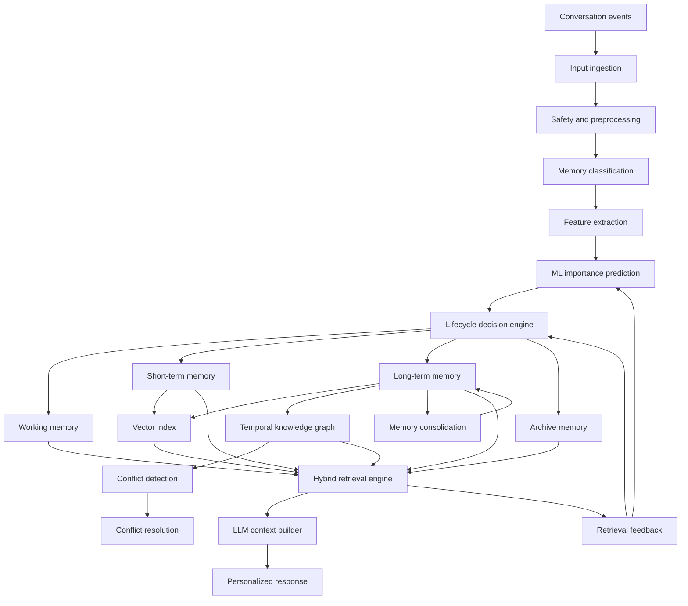
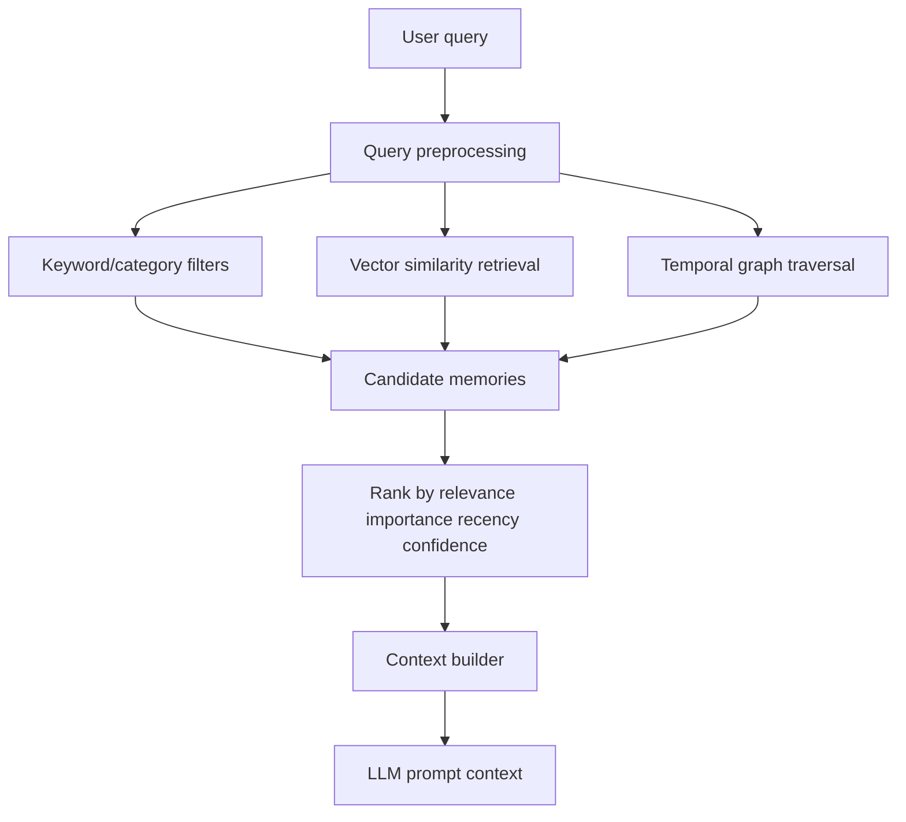

# CogniMem System Design Document

Status: Draft

Owner: Joseph Remingston L

Last updated: September 27, 2026

Related docs:

- `README.md`
- `data/Capstone Project Proposal.pdf`
- `data/Capstone_Base_Paper_Analysis.docx`
- `data/RAG-Driven_Memory_Architectures_in_Conversational_LLMsA_Literature_Review_With_Insights_Into_Emerging_Agriculture_Data_Sharing.pdf`

Scope: This document describes the current implemented Memory Core, CLI, local JSONL store, and the planned complete CogniMem capstone architecture. It clearly separates implemented functionality from planned future components.

## 1. Abstract

CogniMem is a Cognitive Hybrid Memory Architecture for long-term personalized LLM agents. The project is based on the observation that standard vector-only RAG memory systems struggle with long-term personalization, temporal reasoning, contradictory information, lifecycle management, and structured memory types.

The repository currently implements the first foundation layer: a Memory Core with local CLI access and JSONL persistence. This layer accepts raw interaction content, classifies the content into a memory category, extracts scoring features, calculates a heuristic importance score, assigns a lifecycle tier, and returns a serializable memory record that can be saved locally.

The core now includes local semantic/hybrid retrieval, cited Gemini RAG, SQLite temporal graph indexes, external evaluation, an authenticated FastAPI/demo surface, privacy endpoints, operational probes/metrics, and deterministic LSH ANN retrieval. Production database migration and deployment remain separate planned work. ML research remains separate. See [the current retrieval/graph design](docs/retrieval_graph.md).

## 2. Repository Analysis

The current repository contains:

| Area | Status | Notes |
| --- | --- | --- |
| `main/` | Implemented | Python package containing the Memory Core, CLI entry point, and local JSONL store modules. |
| `tests/` | Implemented | Unit tests for classification, scoring, lifecycle assignment, serialization, local storage, CLI behavior, and graph isolation. |
| `README.md` | Implemented | Current implementation explanation and next-step roadmap. |
| `data/` | Source documentation | Capstone proposal, base paper analysis, and base literature review paper. |
| Local storage | Implemented | JSONL-backed local memory store at `memory_store/memories.jsonl` by default. |
| CLI | Implemented | `python3 -m main` supports process, list, search, get, and stats commands. |
| Production database layer | Not implemented | SQLite indexes exist; authoritative concurrent server storage is still planned. |
| RAG/vector layer | Implemented locally | BGE embeddings, SQLite vectors, hybrid retrieval, bounded context, and LangChain Gemini with checked citations. |
| Graph layer | Implemented locally | Typed SQLite graph with provenance, valid/recorded time, aliases, task edges, and traversal. |
| ML training | Experimental implementation | XGBoost trained on Hippocorpus importance ratings; reproducible training and held-out metrics in `reports/importance_report.md`. |
| REST API | Implemented | FastAPI authentication, memory, search, health, metrics, and privacy endpoints. |

## 3. Implemented, Partial, Planned, and Out of Scope

Implemented:

- `MemoryInput` model for raw incoming interactions.
- `MemoryRecord` model for normalized memory objects.
- `MemoryCategory` values: `semantic`, `episodic`, `procedural`, `preference`, `task`, and `temporary`.
- `MemoryTier` values: `working`, `short_term`, `long_term`, and `archive`.
- Rule-based memory classification.
- Feature extraction for scoring.
- Heuristic importance scoring.
- Lifecycle tier assignment.
- Serialization and deserialization.
- Local JSONL memory persistence through `LocalMemoryStore`.
- Ranked keyword retrieval through `MemoryRanker`, with configurable signal weights and recency half-life.
- CLI commands for processing, listing, searching, getting records, and store statistics.
- Tests for core behavior, local store behavior, CLI behavior, and graph isolation.
- Supported assertion conflict detection, automatic/explicit resolution, and durable-memory consolidation.
- Revision history and idempotent bulk reconciliation of existing records.

Partially implemented:

- Graph language coverage: temporal storage/traversal work; automatic extraction covers only supported complete assertions. Structured relationships support richer caller-provided data.
- Memory lifecycle: task deadline parsing, expiry filtering, resolved-task visibility, and inactivity archive views exist. Scheduled physical expiry cleanup and lossless compaction are implemented; archive migration remains planned.
- Importance modeling: heuristic default plus optional trained XGBoost proxy; conversational validation remains outstanding.
- Retrieval quality: keyword/vector/graph/hybrid retrieval work; external results expose extraction and retention limitations.

Planned:

- In-domain validation and calibration of XGBoost importance prediction.
- In-domain conversational training labels beyond Hippocorpus.
- Production storage backend.
- Broader graph entity/relation extraction from paragraphs.
- Controlled forgetting.
- Continuous learning from feedback/retrieval success.
- Evaluation against vector-only RAG, Mem0, MemGPT, LangMem, or similar baselines.

Out of scope for the current phase:

- Neo4j setup.
- Distributed graph deployment.
- Unbounded graph reasoning.
- Training custom embedding models.
- Fine-tuning generation models.
- Cloud deployment.

## 4. Current System Overview

The current implementation solves two narrow but important problems: converting raw conversational content into a structured memory object, and saving/inspecting those records through a local JSONL store and CLI.

It provides local append-only storage, ranked keyword/semantic/hybrid retrieval, cited RAG, and temporal graph traversal. Production concurrent storage remains planned.

Current objective:

- Accept a raw interaction.
- Classify the memory type.
- Extract useful memory features.
- Score memory importance.
- Assign a lifecycle tier.
- Return a normalized record.
- Save records locally as JSONL when requested through the CLI or `LocalMemoryStore`.
- Inspect stored records through list, get, search, and stats commands.

Current research-methodology alignment:

- The base paper discusses semantic, episodic, procedural, and emotional memory, plus hybrid memory systems.
- The capstone adapts that direction into implementable categories: semantic, episodic, procedural, preference, task, and temporary.
- The current repository implements classification and lifecycle foundations, but not the full hybrid memory architecture yet.

## 5. Current Architecture


```mermaid
flowchart TD
    A[Raw user or assistant message] --> B[MemoryInput]
    B --> C[MemoryClassifier]
    C --> D[MemoryRecord.from_input]
    D --> E[FeatureExtractor]
    E --> F[ImportanceScorer]
    F --> G[LifecycleManager]
    G --> H[Final MemoryRecord]
    H --> I[to_dict serialization]
    I --> J[LocalMemoryStore JSONL]
    J --> K[CLI list search get stats]
```

Current architecture properties:

- Runs in-process as Python code.
- Uses no external services.
- Uses a local JSONL file store for development/demo persistence.
- Uses no graph database.
- Uses no vector database.
- Offers an offline XGBoost training pipeline and optional ML runtime dependencies.
- Produces serializable Python objects and JSON CLI output.

Default conversational rules use whole-word matching, indirect preferences, explicit constraint/event recognition, conservative negation handling, and short-term handling of one-off tasks. The optional Hippocorpus model retains its legacy preprocessing. See [rule experiment](docs/reports/heuristic_improvements.md) for results and limitations.

## 6. Current Component Design

| Component | File | Responsibility | Input | Output |
| --- | --- | --- | --- | --- |
| Public API | `main/__init__.py` | Exposes the Memory Core classes and enums. | Imports from caller code. | Importable package API. |
| Memory models | `main/domain/models.py` | Defines memory input, memory record, categories, tiers, timestamps, and serialization. | Raw field values or dict payload. | `MemoryInput` and `MemoryRecord`. |
| Classifier | `main/domain/classification.py` | Categorizes content using deterministic keyword/pattern rules. | `MemoryInput`. | `MemoryCategory`. |
| Feature extractor | `main/domain/features.py` | Converts content and metadata into numeric scoring features. | `MemoryInput`, `MemoryRecord`. | `dict[str, float]`. |
| Importance scorer | `main/domain/scoring.py` | Applies heuristic weights to features. | Feature dictionary. | Float score from `0.0` to `1.0`. |
| Lifecycle manager | `main/domain/lifecycle.py` | Assigns memory tier and expiry/archive hints. | `MemoryRecord`, score. | `MemoryTier`, timestamp hints. |
| Memory orchestrator | `main/application/core.py` | Runs the full processing pipeline. | `MemoryInput`. | Final `MemoryRecord`. |
| Local memory store | `main/storage/store.py` | Saves, loads, filters, gets, and keyword-searches JSONL memory records. | `MemoryRecord` or filter/query arguments. | Stored or retrieved `MemoryRecord` objects. |
| Retrieval ranker | `main/retrieval/ranker.py` | Ranks whole-word matches by keyword coverage, category, tier, recency, and importance. | Query and filtered records. | Ordered records. |
| CLI | `main/__main__.py` | Provides terminal commands for process, list, search, get, and stats. | Command-line arguments. | JSON output. |
| Graph contract | `main/graph/interfaces.py` | Defines the graph adapter protocol. | `MemoryRecord`. | Graph integration contract. |
| Tests | `tests/test_memory_core.py`, `tests/test_memory_store_cli.py` | Verifies current behavior. | Unit test examples. | Passing tests. |

Task completion/cancellation and multi-memory processing are implemented conservatively via `LocalMemoryStore.ingest()` and `MemoryCore.process_many()`. The JSONL store retains revisions, with the latest row per ID used for reads. Detailed policies and limitations: [lifecycle changes](docs/reports/lifecycle_improvements.md).

## 7. Current Data Contracts

### MemoryInput

| Field | Type | Required | Description |
| --- | --- | --- | --- |
| `content` | `str` | Yes | Raw message text. Must not be empty. |
| `user_id` | `str` | Yes | User identifier. Must not be empty. |
| `session_id` | `str` | Yes | Session/conversation identifier. Must not be empty. |
| `role` | `str` | No | Source role. Defaults to `user`. |
| `timestamp` | `datetime` | No | Message timestamp. Defaults to current UTC time. |
| `metadata` | `dict[str, Any]` | No | Optional caller-provided metadata such as `interaction_score`. |

### MemoryRecord

| Field | Type | Description |
| --- | --- | --- |
| `id` | `str` | Generated UUID for the memory record. |
| `content` | `str` | Cleaned memory content. |
| `user_id` | `str` | User identifier. |
| `session_id` | `str` | Session identifier. |
| `category` | `MemoryCategory` | Classified memory category. |
| `tier` | `MemoryTier` | Assigned lifecycle tier. |
| `created_at` | `datetime` | Creation timestamp. |
| `updated_at` | `datetime` | Last update/access timestamp. |
| `confidence` | `float` | Current default is `1.0`. |
| `importance_score` | `float` | Heuristic importance score. |
| `access_count` | `int` | Access counter, incremented by `touch()`. |
| `source_metadata` | `dict` | Metadata copied from `MemoryInput`. |
| `features` | `dict[str, float]` | Extracted scoring features. |
| `expires_at` | `datetime | None` | Expiry hint for working/short-term memory. |
| `archive_after` | `datetime | None` | Archive hint for long-term memory. |

## 8. Current Data Flow

Input format:

```python
MemoryInput(
    content="I prefer concise technical summaries.",
    user_id="user_001",
    session_id="session_001",
    metadata={"interaction_score": 0.5},
)
```

Intermediate transformations:

- The classifier maps content to one category.
- A `MemoryRecord` is created from the input.
- Feature extraction calculates category flags, recency, entity density, task/preference indicators, sentiment strength, access frequency, and word-count normalization.
- Importance scoring applies heuristic weights.
- Lifecycle assignment chooses the memory tier and timestamp hints.

Output format:

```python
{
    "id": "generated-uuid",
    "content": "I prefer concise technical summaries.",
    "user_id": "user_001",
    "session_id": "session_001",
    "category": "preference",
    "tier": "long_term",
    "importance_score": 0.6337,
    "features": {"category_preference": 1.0, "...": "..."},
    "expires_at": None,
    "archive_after": "future UTC timestamp"
}
```

## 9. Current Model Design

An optional XGBoost regression model is trained on Hippocorpus personal-event importance ratings. `MemoryCore.with_ml()` enables it; the heuristic remains the default. See [experiment report](docs/reports/importance_report.md) for measured results and limitations.

Current classifier:

- Type: deterministic rule-based classifier.
- Inputs: raw content from `MemoryInput`.
- Output: one `MemoryCategory`.
- Method: keyword and regular-expression matching.

Current importance model:

- Type: default heuristic scorer or optional XGBoost regression model.
- Inputs: extracted feature dictionary; ML adds deterministic hashed word counts.
- Output: float score from `0.0` to `1.0`.
- Method: heuristic weighted sum, or trained XGBoost prediction clamped to 0–1.

Current lifecycle model:

- Type: deterministic rule-based tier assignment.
- Inputs: `MemoryRecord` and importance score.
- Output: one `MemoryTier`.
- Method: threshold and category checks.

The offline training workflow evaluates four configurations using validation RMSE and early stopping, then evaluates the selected model on a held-out test set. Native model artifacts and metadata are stored under `artifacts/importance/`. There is no model registry.

## 10. Current Storage Design

Current storage has two levels:

- In-memory Python objects returned by `MemoryCore.process()`.
- Local JSONL persistence through `LocalMemoryStore`, with the default CLI path `memory_store/memories.jsonl`.

| Data type | Current storage |
| --- | --- |
| Raw datasets | Research documents plus downloaded Hippocorpus under ignored `data/hippocorpus/`. |
| Processed datasets | Features computed in memory during training; split IDs saved under `reports/`. |
| Features | Stored inside returned `MemoryRecord.features` and persisted in JSONL when saved. |
| Trained models | Native XGBoost model and metadata under `artifacts/importance/`. |
| Experiment results | Importance regression metrics, split IDs, and test predictions under `reports/`. |
| Logs | Not implemented. |
| Configuration files | Not implemented. |
| Memory records | In-memory object and optional JSONL records via `LocalMemoryStore`. |

JSONL remains the local source log with cooperative cross-process locking on macOS/Linux. Rebuildable SQLite indexes provide vector search and temporal graph traversal.

## 11. Current Evaluation

Current evaluation includes automated tests, the Hippocorpus regression experiment, and a 48-case developer-authored conversational check. Human review remains pending; see `evaluation/README.md`.

The tests verify:

- Classification for semantic, episodic, procedural, preference, task, and temporary memory.
- Durable memories score higher than greetings.
- Lifecycle tier assignment.
- Serialization/deserialization stability.
- Local JSONL save/list/get/search behavior.
- CLI process/list/get behavior.
- Absence of Neo4j/graph database dependency in the Memory Core.

Run tests:

```bash
python3 -m unittest -v
```

## 12. Current Data Flow Diagram


```mermaid
flowchart LR
    A[MemoryInput content user_id session_id metadata] --> B[Rule-based classification]
    B --> C[MemoryRecord skeleton]
    C --> D[Feature extraction]
    D --> E[Heuristic importance score]
    E --> F[Tier assignment]
    F --> G[Serializable MemoryRecord]
    G --> H[Optional JSONL save]
    H --> I[CLI list search get stats]
```

## 13. Complete Capstone System Overview

The complete CogniMem system will implement a production-oriented hybrid memory engine for personalized LLM agents. It will combine rule-based and ML-based memory decisions, persistent stores, vector retrieval, graph-based temporal reasoning, consolidation, conflict resolution, and evaluation.

The planned system is supported by the capstone proposal and base-paper analysis. The proposal lists working memory, short-term memory, long-term memory, archive memory, RAG, knowledge graphs, and machine learning as core architecture elements.

## 14. Complete Capstone Architecture


```mermaid
flowchart TD
    A[Conversation events] --> B[Input ingestion]
    B --> C[Safety and preprocessing]
    C --> D[Memory classification]
    D --> E[Feature extraction]
    E --> F[ML importance prediction]
    F --> G[Lifecycle decision engine]
    G --> H[Working memory]
    G --> I[Short-term memory]
    G --> J[Long-term memory]
    G --> K[Archive memory]
    J --> L[Vector index]
    J --> M[Temporal knowledge graph]
    I --> L
    M --> N[Conflict detection]
    N --> O[Conflict resolution]
    J --> P[Memory consolidation]
    P --> J
    H --> Q[Hybrid retrieval engine]
    I --> Q
    J --> Q
    K --> Q
    L --> Q
    M --> Q
    Q --> R[LLM context builder]
    R --> S[Personalized response]
    Q --> T[Retrieval feedback]
    T --> F
    T --> G
```

Planned complete architecture responsibilities:

- Ingest conversation events with metadata.
- Preprocess and validate input.
- Classify memories into supported memory categories.
- Extract features for ML scoring.
- Predict importance using LightGBM/XGBoost.
- Store memories in appropriate lifecycle tiers.
- Build vector indexes for semantic retrieval.
- Build a temporal knowledge graph for relationships and chronology.
- Detect and resolve contradictory memories.
- Consolidate repeated observations into stronger memories.
- Forget or archive low-value/stale memories.
- Retrieve memory using vector similarity, graph traversal, timestamps, importance score, and user context.
- Evaluate against traditional RAG and existing memory-system baselines.

## 15. Complete System Components

| Component | Planned responsibility | Current status |
| --- | --- | --- |
| Ingestion layer | Accept user/assistant messages and metadata. | Partially implemented through `MemoryInput`. |
| Preprocessing layer | Clean, normalize, validate, and optionally redact input. | Basic validation only. |
| Memory classifier | Classify memory type. | Rule-based version implemented. |
| Feature extractor | Generate scoring features. | Baseline implemented. |
| Importance predictor | Decide storage value using ML. | Heuristic default; experimental XGBoost scorer implemented. |
| Lifecycle manager | Assign tier, expiry, archive behavior. | Deadlines, inactivity archival, and expiry visibility implemented. |
| Memory store | Persist memory records. | Local JSONL implemented; production storage planned. |
| Vector store | Store embeddings for retrieval. | SQLite normalized vectors with exact cosine retrieval for small corpora and random-hyperplane LSH ANN retrieval above the configured threshold. |
| Temporal knowledge graph | Store entities, relationships, and timestamps. | SQLite graph with bitemporal edges, aliases, evidence, and bounded traversal implemented. |
| Conflict resolver | Detect contradictory memories and pick retained fact. | Implemented for supported assertions, with automatic policy, explicit selection, and history. |
| Consolidation engine | Merge repeated observations into useful summaries. | Equivalent claims and exact durable duplicates consolidate with source evidence. Generalized knowledge inference is not implemented. |
| Forgetting engine | Expire/archive memories based on value and age. | Read visibility, archive views, physical expiry cleanup, and lossless compaction implemented. |
| Hybrid retriever | Combine vector, graph, temporal, importance, and context signals. | Weighted rank fusion builds a candidate pool; a local cross-encoder reranks Top-K. Importance/category/tier/recency enter the keyword channel. |
| CLI | Developer access surface for process/list/search/get/stats. | Implemented. |
| REST API | HTTP access surface for backend/UI/agent integration. | FastAPI implementation with JWT/RBAC, privacy endpoints, validation, and standardized responses. |
| Evaluation pipeline | Compare retrieval accuracy, personalization, efficiency, coherence. | External retrieval/retention reports implemented; human judgment and generated-answer quality pending. |

## 16. Complete Training Pipeline

The current training pipeline uses existing Hippocorpus story text and importance ratings. Author/story-family-disjoint splits protect evaluation. The broader planned dataset would also include conversational category and lifecycle tier labels.


```mermaid
flowchart LR
    A[Labeled memory examples] --> B[Feature extraction]
    B --> C[Train LightGBM or XGBoost]
    C --> D[Validate model]
    D --> E[Save model artifact]
    E --> F[ImportanceScorer replacement]
```

Planned training data fields:

- `content`
- `category`
- `importance_score` or `importance_label`
- `tier`
- `recency`
- `access_frequency`
- `sentiment_strength`
- `entity_density`
- `interaction_signal`
- `retrieval_success`

Hippocorpus supplies the current importance target; the broader conversational category/tier dataset does not yet exist.

## 17. Complete Retrieval Pipeline


```mermaid
flowchart TD
    A[User query] --> B[Query preprocessing]
    B --> C[Keyword/category filters]
    B --> D[Vector similarity retrieval]
    B --> E[Temporal graph traversal]
    C --> F[Candidate memories]
    D --> F
    E --> F
    F --> G[Rank by relevance importance recency confidence]
    G --> H[Context builder]
    H --> I[LLM prompt context]
```

The final retrieval strategy should combine:

- vector similarity
- graph traversal
- timestamp/recency
- importance score
- confidence
- user/session context
- memory tier

The local implementation uses keyword/dense/graph rank fusion, local cross-encoder
reranking, a character-budgeted context, and cited Gemini responses. See
[implementation details](docs/retrieval_graph.md); production scale and broader
extraction remain future work.

## 18. APIs and Interfaces

Current public Python interface:

```python
from main import LocalMemoryStore, MemoryCore, MemoryInput

record = MemoryCore().process(
    MemoryInput(
        content="I prefer concise technical summaries.",
        user_id="user_001",
        session_id="session_001",
    )
)

LocalMemoryStore().save(record)
```

Current CLI interface:

```bash
python3 -m main process --user-id user_001 --session-id session_001 "I prefer concise summaries"
python3 -m main list --user-id user_001 --pretty
python3 -m main search "technical summaries" --user-id user_001 --pretty
python3 -m main get MEMORY_ID --pretty
python3 -m main stats --pretty
```

Implemented REST API examples:

```text
POST /api/v1/auth/signup
POST /api/v1/auth/login
POST /api/v1/memories
GET  /api/v1/memories
GET  /api/v1/memories/{id}
POST /api/v1/memories/search
GET  /api/v1/me/export?format=json|csv
DELETE /api/v1/me
GET /health/live
GET /health/ready
GET /metrics
```

## 19. Security and Privacy Considerations

Current state:

- Local JSONL persistence remains authoritative and may contain sensitive user memory content.
- Argon2 password hashing and short-lived JWT access tokens are implemented.
- Protected routes enforce user/admin roles and derive ownership from the authenticated subject.
- Structured JSON logging, request IDs, Prometheus metrics, and health probes are implemented.
- JSON/CSV export and account deletion are implemented.

Future requirements:

- User memory must be isolated by `user_id`.
- Sensitive content should be minimized and redacted where possible.
- Logs should not leak raw private memory content.
- Any graph/vector/database layer must enforce user-level data boundaries.
- Retrieval must avoid mixing memories between users or sessions.

## 20. Operational Readiness

Operational signals now include HTTP request counts/latency, authentication events, memory-ingestion counts, JSON structured request logs, and liveness/readiness checks.

Future operational signals:

| Signal | Purpose |
| --- | --- |
| Processing success rate | Confirm memory events are processed reliably. |
| Classification distribution | Detect classifier drift or rule mistakes. |
| Importance score distribution | Detect scoring bias or threshold problems. |
| Retrieval precision/recall | Evaluate memory usefulness. |
| Storage growth | Monitor JSONL and future database memory bloat. |
| Conflict rate | Track contradictory memories. |
| Consolidation rate | Measure reduction in repeated memories. |
| Forgetting/archive rate | Confirm lifecycle cleanup works. |

## 21. Alternatives Considered

| Alternative | Why considered | Why not selected as the current architecture |
| --- | --- | --- |
| Vector-only RAG memory | Simple and common for conversational memory. | The proposal identifies limitations in chronology, personalization, lifecycle management, and conflict handling. |
| Graph-only memory | Strong for relationships and temporal reasoning. | Does not solve semantic similarity retrieval alone; implemented as one hybrid retrieval channel. |
| LLM-only memory extraction | Flexible and semantically rich. | Adds cost, latency, nondeterminism, and external dependencies before the core is stable. |
| ML-first classifier/scorer | Better long-term adaptability. | Requires labeled data that does not exist yet. |
| Full-stack implementation first | Would show an end-to-end demo earlier. | Higher risk because core contracts, memory schema, and lifecycle behavior need to stabilize first. |

## 22. Open Questions

- Should the next production storage backend be SQLite, Postgres, or a document database?
- Which conversational dataset can validate transfer of Hippocorpus-trained importance scoring?
- How should the local LSH ANN configuration be tuned against workload size and recall?
- How should paragraph-level extraction extend the implemented typed bitemporal graph?
- Which independent human judgments and full-system baselines should extend LoCoMo/LongMemEval?
- How should privacy, deletion, and export be handled for user memories?

## 23. Recommended Next Steps

1. Configure the implemented conservative expiry cleanup worker; broader forgetting policies remain future work.
2. Complete production storage and deployment as a separate infrastructure track.
3. Improve extraction coverage and evaluate hosted answer quality.
4. Extend external retrieval/retention evidence with independent human conflict/personalization judgments.
5. Add background reminder delivery and the human feedback loop as separate capstone tracks.
6. Tune the implemented LSH ANN configuration when workloads require it.

ML modeling and its datasets are a separate research track.

## 24. Current Milestone

The current milestone is:

```text
Structured Memory Core, ranked keyword retrieval, local JSONL store, and CLI implemented.
```

The project has implemented memory structure, processing decisions, local JSONL storage, ranked keyword search, and CLI access. It now includes local vector/hybrid retrieval, cited RAG, temporal graph indexes, and external evaluation. Production concurrent storage, deployment, broader extraction, background reminder delivery, human feedback, and human quality evaluation remain. ML research is separate.

## 25. Conversational Task Updates

The heuristic recognizes indirect preferences and retains their original negation.
`process_many()` splits explicit independent clauses outside quoted spans. Task
state changes are recognized separately from classification; questions, reported
speech, hypotheticals, and negated completion cannot resolve tasks.

`ingest()` identifies an active task belonging to the observation's user, preferring
an exact normalized object and then a unique noun subset. Numeric identifiers
must match. Bare pronouns are restricted to one candidate in the same session.
Ambiguity is returned with candidate IDs. `task_id` supplies an explicit reference.
Updates preserve the task ID and append a revision plus an observation. Duplicate
event IDs are idempotent. Event chronology is enforced against `updated_at`.

Rescheduling parses the replacement date separately from the old date, updates
`due_at`, and recalculates one-off expiry. Relative postponement uses the current
deadline. Unknown/alternative dates do not mutate state. A narrow “not due X but Y”
correction is supported without treating general negation as completion.

Recurring tasks store `recurrence` (unit, interval, anchor, index), `next_due_at`,
and `task_occurrences`. `due_at` remains null for the standing series. The first
anchor comes from the input date/time or explicit `due_at`. Supported schedules
are daily, weekly, monthly, yearly, one named weekday, or integer intervals.
Calendar month/year arithmetic clamps invalid days against the original anchor,
so January 31 → February 28 → March 31 does not drift. Anchor offsets are fixed;
named timezone/DST schedules and combined/exclusion schedules are unsupported.

Each completion/cancellation advances one occurrence and leaves the series active.
The cursor tracks the oldest unresolved occurrence; reads never advance it. An
unqualified completion must refer to an occurrence due that local day, otherwise
`occurrence_at` is required. That field accepts its original or rescheduled ISO
date/time. Already resolved occurrences are recognized. Occurrence rescheduling
keeps the cadence and cannot cross the next occurrence. `task_scope=series` resets
the anchor or closes the series; re-anchoring cannot overlap resolved history.

See [current behavior and verification](docs/reports/lifecycle_improvements.md) and
[CLI examples](README.md#deadlines-task-updates-and-multiple-memories).

## 26. Assertion Reconciliation and Consolidation

`main/domain/claims.py` extracts a narrow single assertion: subject, predicate, normalized
value, polarity, and exclusivity. The default classifier recognizes those forms;
the optional scorer retains its frozen classification preprocessing. Ingestion
recomputes claims from the original content, including older records without
claim fields. Current user assertions with the same subject/predicate are checked
for opposing polarity or different values on an exclusive attribute. Compatible
likes and negative claims about different values remain independent.

`main/domain/reconciliation.py` compares source priority, confidence, observation time,
then importance. The best actual supporting observation determines a group's
rank. A rejected assertion does not supersede compatible existing facts. An exact
tie keeps an existing assertion. Source priority/confidence are caller-supplied,
not authenticated source identity or learned certainty. Automatic decisions,
manual selections, and conflict links are persisted as revisions. `last_confirmed_at` makes explicit reaffirmation participate in observation ordering; it is separate from access time.

`memory_status` is separate from lifecycle tier: active, superseded, consolidated.
Superseded records point to their replacement; consolidated observations point to
a canonical record. That record retains original content plus a summary,
evidence IDs/session IDs, and observation range. Fresh evidence renews retention
and retrieval recency without raising confidence/importance by repetition.
Evidence must exist, belong to the same user, and support the same assertion.

Only durable user facts/preferences/procedures consolidate, using equivalent
claims or exact normalized text. Events and tasks retain separate identities.
A change followed by a return to an old value creates a new assertion episode.
No facts are invented from repeated mentions. Historical, uncertain, reported,
and compound statements are not interpreted as unconditional replacements.
Unsupported language remains stored; geographic and entity aliases are not
resolved by the extractor.

List/search omit superseded and consolidated records unless `include_history`
is enabled. Search also indexes summary text; session filters match evidence
sessions. `get`/`all` retain administrative visibility. `history` returns all
revisions of a specific user-owned ID. Explicit `resolve_conflict` restores a
supported root and supersedes its active contradictions. `reconcile_memories`
replays current durable roots in memory and appends only changed records, making
bulk processing idempotent. It does not rewrite prior JSONL rows or lock writers.

See [README usage](README.md#conflicts-current-memories-and-consolidation) and
[verification](docs/reports/memory_reconciliation.md).

## 28. Retrieval and temporal graph implementation

The implementation contract, SQLite schema behavior, query examples, hosted
configuration, time semantics, extraction bounds, and citation checks are in
[docs/retrieval_graph.md](docs/retrieval_graph.md). External benchmark results and
limits are in [reports/retrieval_graph_report.md](docs/reports/retrieval_graph_report.md).

## Scheduled cleanup and evaluation operations

See [cleanup policy, locking, failure recovery, and scheduling](docs/cleanup.md),
[unified external evaluation](docs/reports/independent_evaluation.md), and
[blind independent review instructions](evaluation/README.md). Human
personalization and conflict-policy scores remain pending actual reviews.
